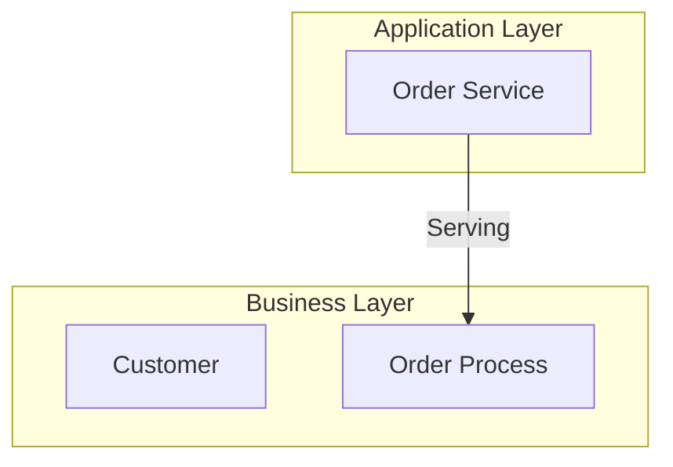

# ArchiMate MCP Server

An MCP (Model Context Protocol) server that enables LLMs to work with ArchiMate models stored in coArchi2 repositories. The server design follows the ArchiMate 3.2 specification structure, making it intuitive for LLMs to select appropriate layers, elements, and relationships.

## Features

- **Full ArchiMate 3.2 Support**: All element types across Motivation, Strategy, Business, Application, Technology, and Implementation & Migration layers
- **Relationship Validation**: Enforces valid ArchiMate relationships per the specification
- **LLM-Friendly Design**: Layer-specific tools with enumerated element types guide correct usage
- **coArchi2 Compatible**: Reads and writes `model.archimate` XML files
- **ArchiMate Exchange Format**: Import/export using the standard ArchiMate Open Exchange Format
- **Multiple Export Formats**: SVG, PNG, Mermaid diagrams, Markdown documentation, and interactive HTML decks
- **Audit Logging**: Track all model operations with NDJSON audit logs
- **Impact Analysis**: Analyze dependencies and impacts of architecture changes

## Installation

### Prerequisites

- Node.js 18+
- npm

### Build from Source

```bash
cd archimate-mcp-server
npm install
npm run build
```

## Usage with Claude Code

### Quick Install (npx)

```bash
claude mcp add archimate -- npx -y archimate-mcp-server
```

### Build from Source

Clone and build, then add to Claude Code:

```bash
git clone https://github.com/thijs-hakkenberg/archimate-mcp.git
cd archimate-mcp
npm install
npm run build
claude mcp add archimate -- node $(pwd)/dist/index.js
```

Verify it was added:
```bash
claude mcp list
```

Remove if needed:
```bash
claude mcp remove archimate
```

## Usage with Claude Desktop

Add to your Claude Desktop configuration file:

**macOS**: `~/Library/Application Support/Claude/claude_desktop_config.json`
**Windows**: `%APPDATA%\Claude\claude_desktop_config.json`

```json
{
  "mcpServers": {
    "archimate": {
      "command": "node",
      "args": ["/path/to/archimate-mcp-server/dist/index.js"]
    }
  }
}
```

## Available Tools (32 total)

### Model Management
| Tool | Description |
|------|-------------|
| `archimate_open_model` | Open a model from a coArchi repository |
| `archimate_save_model` | Save the current model |
| `archimate_create_model` | Create a new empty model |

### Navigation
| Tool | Description |
|------|-------------|
| `archimate_list_elements` | List elements (optionally filtered by layer/type) |
| `archimate_get_element` | Get element details with relationships |
| `archimate_find_elements` | Search elements by name pattern |

### Element Creation (Layer-Specific)
| Tool | Element Types |
|------|---------------|
| `archimate_create_motivation_element` | Stakeholder, Driver, Assessment, Goal, Outcome, Principle, Requirement, Constraint, Meaning, Value |
| `archimate_create_strategy_element` | Resource, Capability, ValueStream, CourseOfAction |
| `archimate_create_business_element` | BusinessActor, BusinessRole, BusinessCollaboration, BusinessInterface, BusinessProcess, BusinessFunction, BusinessInteraction, BusinessEvent, BusinessService, BusinessObject, Contract, Representation, Product |
| `archimate_create_application_element` | ApplicationComponent, ApplicationCollaboration, ApplicationInterface, ApplicationFunction, ApplicationInteraction, ApplicationProcess, ApplicationEvent, ApplicationService, DataObject |
| `archimate_create_technology_element` | Node, Device, SystemSoftware, TechnologyCollaboration, TechnologyInterface, Path, CommunicationNetwork, TechnologyFunction, TechnologyProcess, TechnologyInteraction, TechnologyEvent, TechnologyService, Artifact, Equipment, Facility, DistributionNetwork, Material |
| `archimate_create_implementation_element` | WorkPackage, Deliverable, ImplementationEvent, Plateau, Gap |
| `archimate_create_composite_element` | Grouping, Location |

### Relationships
| Tool | Description |
|------|-------------|
| `archimate_create_relationship` | Create a relationship (validates against ArchiMate spec) |
| `archimate_list_relationships` | List relationships |
| `archimate_get_valid_relationships` | Get valid relationship types between element types |

**Supported Relationship Types**: Composition, Aggregation, Assignment, Realization, Serving, Access, Influence, Association, Triggering, Flow, Specialization

### Views/Diagrams
| Tool | Description |
|------|-------------|
| `archimate_list_views` | List all diagram views |
| `archimate_create_view` | Create a new view |
| `archimate_add_to_view` | Add an element to a view |
| `archimate_add_connection_to_view` | Add a relationship connection (line/arrow) between elements in a view |

### Modification
| Tool | Description |
|------|-------------|
| `archimate_update_element` | Update element name/documentation |
| `archimate_delete_element` | Delete element and its relationships |
| `archimate_delete_relationship` | Delete a relationship |

### Analysis
| Tool | Description |
|------|-------------|
| `archimate_layer_summary` | Get element counts by layer |
| `archimate_impact_analysis` | Analyze element dependencies |

### Exchange Format (Import/Export)
| Tool | Description |
|------|-------------|
| `archimate_import_exchange` | Import model from ArchiMate Open Exchange XML |
| `archimate_export_exchange` | Export model to ArchiMate Open Exchange XML |

### Export Tools
| Tool | Description |
|------|-------------|
| `archimate_export_mermaid` | Generate Mermaid diagram syntax from model or view |
| `archimate_export_diagram` | Export view as SVG or PNG image |
| `archimate_export_markdown` | Export model as Markdown documentation |
| `archimate_export_html_deck` | Export model as interactive HTML deck |

### Audit Logging
| Tool | Description |
|------|-------------|
| `archimate_configure_audit` | Enable/disable audit logging, set log path |
| `archimate_get_audit_log` | Read recent audit log entries |

## Available Resources

| URI | Description |
|-----|-------------|
| `archimate://spec/elements` | Catalog of all ArchiMate element types |
| `archimate://spec/relationships` | Catalog of relationship types |
| `archimate://model/summary` | Current model summary |

## Example Usage

Once connected, you can ask Claude to:

```
Open the ArchiMate model at /path/to/my-model

Create a new Business Actor called "Customer" with documentation "External customer"

Create an Application Component called "Order Service"

Create a Serving relationship from "Order Service" to "Customer"

Show me all elements in the Application layer

What relationships are valid between ApplicationComponent and BusinessProcess?

Do an impact analysis on the "Order Service" component

Export the model as Markdown documentation to /path/to/docs.md

Generate a Mermaid diagram for the Business layer

Export the main view as an SVG to /path/to/diagram.svg

Create an interactive HTML deck of the architecture
```

## Export Formats

### Mermaid Diagrams
Generate Mermaid flowchart syntax that can be rendered in Mermaid-compatible viewers:


### SVG/PNG Diagrams
Export diagram views as scalable SVG or rasterized PNG images with:
- Color-coded elements by layer
- ArchiMate notation
- Relationship lines with appropriate arrows

### Markdown Documentation
Generate comprehensive documentation including:
- Model overview with statistics
- Elements grouped by layer
- Relationship details
- Embedded Mermaid diagrams for views

### HTML Deck
Create an interactive single-file HTML presentation with:
- Tab navigation by layer
- Element cards with relationship details
- Search functionality
- Light/dark theme support
- Embedded SVG diagrams

## Audit Logging

All model operations can be logged to an NDJSON file for auditing:

```json
{"timestamp":"2024-01-15T10:30:00.000Z","event":"archimate_create_business_element","action":"create","elementType":"BusinessActor","elementId":"id-123","elementName":"Customer","success":true,"durationMs":5}
```

Configure via environment variable:
```bash
export ARCHIMATE_AUDIT_LOG=/path/to/audit.ndjson  # Set log path
export ARCHIMATE_AUDIT_LOG=disabled               # Disable logging
```

## Relationship Validation

The server validates relationships against the ArchiMate 3.2 specification. Invalid relationships are rejected with helpful error messages:

```
Error: Assignment is not a valid relationship between DataObject and BusinessActor
Suggestions: Realization, Serving, Association, Flow
```

## Project Structure

```
archimate-mcp-server/
├── src/
│   ├── index.ts              # MCP server entry point
│   ├── model/
│   │   ├── types.ts          # ArchiMate type definitions
│   │   ├── parser.ts         # XML model parser
│   │   └── writer.ts         # XML model writer
│   ├── relationships/
│   │   └── validation.ts     # Relationship validation
│   ├── exporters/
│   │   ├── mermaid-exporter.ts    # Mermaid diagram generation
│   │   ├── svg-exporter.ts        # SVG/PNG diagram rendering
│   │   ├── markdown-exporter.ts   # Markdown documentation
│   │   └── html-deck-exporter.ts  # HTML presentation deck
│   ├── exchange/
│   │   ├── exchange-reader.ts     # ArchiMate Exchange import
│   │   └── exchange-writer.ts     # ArchiMate Exchange export
│   └── audit/
│       └── logger.ts              # Audit logging system
├── dist/                     # Compiled output
├── package.json
├── tsconfig.json
└── vitest.config.ts          # Test configuration
```

## Testing

```bash
npm test              # Run tests
npm run test:watch    # Run tests in watch mode
npm run test:coverage # Run tests with coverage
```

## License

MIT
